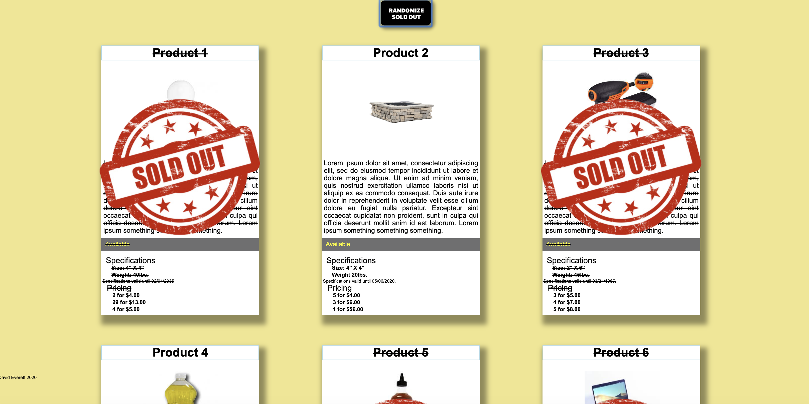

# product-cards

## Description
This project is an exercise in HTML, CSS, and Flexbox layouts.  JavaScript was not required, but in order to add a randomizing feature, a few lines of code were incorporated.  Six mock product cards are laid out in two rows, each with separate sections featuring a product title, image, and information about the product.  Various text stylings, colors, and text-alignments are used in order to follow certain formatting criteria.  The user is also able to click a button at the top, which will randomly decide which products are sold out and overlay a special image over the sold out products.

## Screenshots

## How To Run
1. Clone down this repository.
2. Make sure you have http-server installed via npm.  If not get it [HERE](https://www.npmjs.com/package/http-server)
3. On the command line, run `hs -p 8080`.
4. In your browser, to go `http://localhost:8080`.